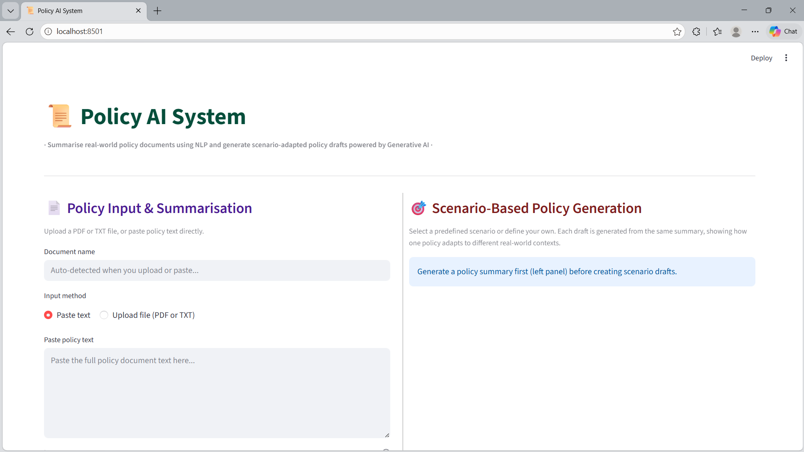

# 📜 Policy AI System
The Policy AI System is an intelligent tool designed to bridge the gap between dense government policy and actionable insights. This system uses a hybrid NLP pipeline to summarize documents and adapt them to specific real-world scenarios.

*A preview of the Policy AI System processing the National Dairy Policy.*

## 🚀 Key Features
- Intelligent Summarization: Combines extractive NLP (TF-IDF + MMR) with generative AI refinement to produce clear, readable summaries.
- Scenario-Based Adaptation: Adapts a single policy (such as the Dairy-Policy.pdf) into specialized drafts for contexts like "Climate Change" or "Youth & Women Entrepreneurship".
- Automated Metadata: Automatically detects document statistics and extracts high-level policy objectives.
- Professional Export: Users can download both summaries and adapted drafts in .txt or .docx formats.
## 🛠️ The Pipeline
1. Document Input: Supports PDF and TXT uploads.
2. NLP Stage: The system performs initial extraction using a frequency-based pipeline.
3. AI Refinement: Summaries are polished for professional tone and coherence.
4. Draft Generation: Scenario logic allows the AI to "re-write" the policy focus based on specific environmental or economic needs.
## 🖥️ Tech Stack
- Language: Python
- Frontend: Streamlit
- Document Handling: pypdf, python-docx
- Data Processing: io, utils (custom summarizer and generator logic)
## 📁 Repository Structure
- app.py: The main Streamlit application script.
- Dairy-Policy.pdf: A reference policy document used for testing and demonstration.
- Demo Video.mp4: A walkthrough of the system's interface and capabilities.
- utils/: Contains the core NLP summarization and draft generation logic.
